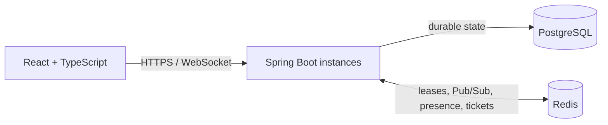

# Real-Time Collaborative Editor

A resume-quality collaborative text editor designed around the hard parts of real-time systems: concurrent edits, deterministic convergence, reconnect recovery, durable history, and multi-instance WebSocket coordination.

The repository is currently in its architecture and specification phase. Application bootstrap and executable setup commands have not been implemented yet.

## Planned capabilities

- Authenticated document creation and sharing
- Concurrent plain-text editing with server-authoritative Operational Transformation (OT)
- Live presence, remote cursors, and selections
- Visible connection and save state
- Reconnect, retry, duplicate-operation handling, and full resynchronization
- Durable autosave and version history
- Collaboration across multiple backend instances
- Automated functional, concurrency, recovery, browser, and load testing

Rich-text collaboration is intentionally outside protocol v1. The first implementation synchronizes a linear text document so convergence behavior remains testable and explainable.

## Architecture

One Redis-elected document leader sequences and transforms operations for each active document. PostgreSQL stores canonical operation history and snapshots before clients receive durable acknowledgements. Redis connects backend instances and holds only recoverable or ephemeral runtime state.

The planned AWS deployment uses S3 and CloudFront for the frontend, ECS Fargate behind an Application Load Balancer for the backend, RDS PostgreSQL, ElastiCache, ECR, Secrets Manager, and CloudWatch.

## Technology stack

- Java and Spring Boot
- React and TypeScript
- Native WebSockets with a versioned JSON protocol
- PostgreSQL
- Redis Pub/Sub and expiring coordination keys
- Docker and Docker Compose
- JUnit, Testcontainers, frontend unit tests, and Playwright
- AWS and GitHub Actions

## Performance targets

These are engineering targets, not measured results:

| Metric | Target |
| --- | ---: |
| Active editors on one document | 50+ |
| Concurrent WebSocket connections | 500+ |
| Durably accepted document operations | 1,000+ ops/sec |
| Source-submit to remote-apply latency | <100 ms p95 |
| Logical revisions exercised in recovery testing | 10,000+ |

The project also plans to evaluate a 40% synchronization-latency improvement and a 60% reduction in PostgreSQL write transactions against recorded baselines. No benchmark result is currently claimed. Methodology and future evidence belong in [docs/BENCHMARKS.md](docs/BENCHMARKS.md).

## Documentation

- [Product specification](docs/PRODUCT_SPEC.md)
- [System architecture](docs/ARCHITECTURE.md)
- [HTTP API contract](docs/API.md)
- [Real-time protocol](docs/REALTIME_PROTOCOL.md)
- [Database contract](docs/DATABASE.md)
- [Testing strategy](docs/TESTING.md)
- [Benchmark methodology](docs/BENCHMARKS.md)
- [Architecture decisions](docs/decisions)
- [Implementation sequence](docs/tasks/README.md)

The documentation hierarchy and development rules are defined in [AGENTS.md](AGENTS.md).

## Development status

The accepted decisions currently select:

- server-authoritative OT over CRDT or whole-document replacement,
- native WebSockets over STOMP or polling,
- a batched PostgreSQL operation log with periodic snapshots,
- Redis Pub/Sub plus expiring leader leases for multi-instance coordination,
- an AWS target based on ECS Fargate, RDS, ElastiCache, S3, and CloudFront.

The first application task is repository bootstrap. Until that task is complete, commands such as `docker compose up` and project test scripts are planned interfaces rather than working setup instructions.
