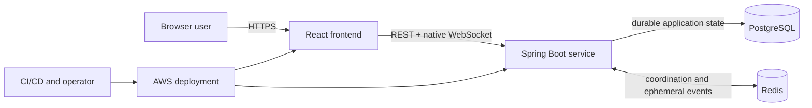
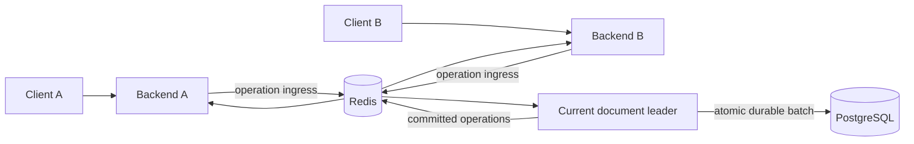
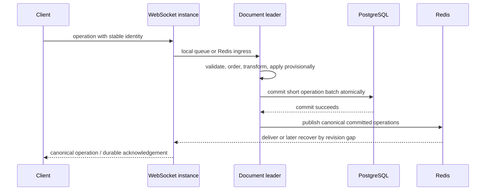
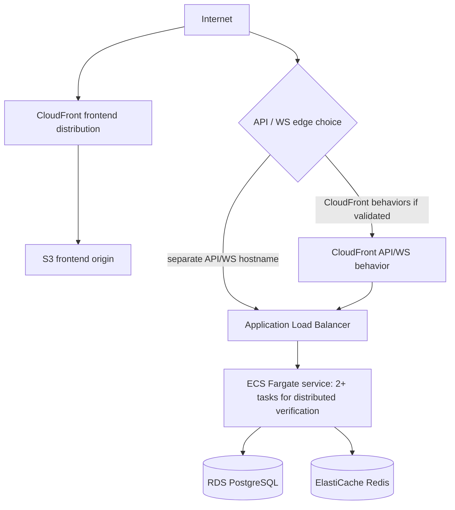

# Architecture — Real-Time Collaborative Editor

## Purpose and status

**Status:** Current high-level architecture

This document describes system components, responsibility boundaries, major data flows, scaling, recovery, deployment, and observability. It deliberately delegates:

- HTTP endpoints and payloads to [API.md](API.md);
- browser/server event schemas to [REALTIME_PROTOCOL.md](REALTIME_PROTOCOL.md);
- durable tables, indexes, and constraints to [DATABASE.md](DATABASE.md);
- synchronization rules to [decisions/ADR-001-sync-strategy.md](decisions/ADR-001-sync-strategy.md);
- persistence, Redis, and AWS rationale to the corresponding ADRs.

Accepted ADRs take precedence over this overview.

## 1. Architectural goals

The architecture prioritizes:

1. deterministic collaborative-editing correctness;
2. durable acceptance and recoverability;
3. explicit failure behavior;
4. horizontal backend scaling;
5. measurable performance;
6. a design one developer can explain and operate.

The v1 synchronized body is a linear Unicode text document. Collaborative rich text is deferred until a separate decision defines its data and convergence model.

## 2. System context

The browser provides the editor and optimistic local experience. The backend authorizes users, establishes a canonical operation order, persists accepted work, and coordinates active sessions. PostgreSQL is the durable authority; Redis supports recoverable distributed runtime behavior.

## 3. Component responsibilities

| Component | Owns | Does not own |
| --- | --- | --- |
| React/TypeScript frontend | User interface, local edit capture, optimistic text, pending-edit state, client-side rebase, connection lifecycle, presence/cursor rendering | Canonical ordering, authorization, durable acceptance |
| Spring Boot backend | REST and WebSocket boundaries, authentication/authorization, document leader behavior, OT sequencing, durable-acceptance orchestration, version restore, recovery, telemetry | Browser rendering, durable storage media, Redis durability |
| PostgreSQL | Users, documents, permissions, canonical operation history, snapshots, versions, token verifiers, transactional revision fencing | Live fan-out, presence, cursor traffic, leader leases |
| Redis | Leader leases, operation ingress, committed-event Pub/Sub, presence, cursor propagation, single-use real-time tickets, narrowly justified caches | Canonical document history or other irreplaceable durable data |
| AWS platform | Static delivery, container execution, load balancing, managed data services, secrets, logs, and metrics | Application-level synchronization correctness |

Synchronization logic remains isolated from HTTP controllers, WebSocket transport, database adapters, Redis adapters, and editor components. Java and TypeScript may integrate with that logic through explicit interfaces and shared test vectors.

## 4. Request and collaboration boundaries

REST handles account operations, document metadata and access, initial snapshots, sharing, version history, restore requests, and creation of short-lived real-time tickets.

WebSocket handles live document operations, canonical operation delivery and acknowledgement, synchronization control, presence, cursors, selections, and permission/reset notifications.

Normal document-body editing does not alternate between WebSocket updates and whole-body REST saves. The browser loads a snapshot through REST and then transitions to the versioned real-time protocol.

## 5. Synchronization model

[ADR-001](decisions/ADR-001-sync-strategy.md) selects server-authoritative Operational Transformation.

Each document timeline has a synchronization epoch and monotonically increasing canonical revisions. A client submits a stable operation identity, the epoch and revision on which the edit was based, and a text operation. One document leader transforms stale but recoverable edits, assigns the next canonical revision, and produces the canonical operation history.

Clients edit optimistically and rebase canonical remote operations against local unacknowledged intent. Duplicate retries use the same logical operation identity and apply at most once.

An intentional timeline replacement, initially version restore, creates a new epoch instead of rewinding a revision counter. Clients from the old epoch must fully resynchronize.

Detailed primitive operations, position units, transformation rules, and pending-operation behavior belong in ADR-001 and [REALTIME_PROTOCOL.md](REALTIME_PROTOCOL.md).

## 6. Document leadership and horizontal scaling

Every actively edited document has at most one intended leader at a time. Redis grants a short-lived lease to one Spring Boot instance, while a conditional PostgreSQL revision update supplies a second safety fence at commit time.

A WebSocket can terminate on any healthy backend instance; connection ownership and document leadership are separate.

A local leader can bypass the Redis ingress hop, but committed operations still follow the normal fan-out path. Correctness cannot depend on load-balancer stickiness.

## 7. Durable collaboration flow

An operation is not reported as saved until its PostgreSQL transaction commits. Short batching reduces transaction overhead but adds a bounded portion of acknowledgement latency. Final thresholds are configuration selected by measurement, not architectural guarantees.

## 8. Persistence and recovery

[ADR-003](decisions/ADR-003-persistence-strategy.md) selects a batched append-only canonical operation log plus periodic full-text snapshots.

Every new document begins with a revision-0 snapshot, including any optional initial text. An active leader keeps materialized text and recent canonical operations in memory. A new leader reconstructs state from the latest valid snapshot plus later operation batches.

User-visible versions reference exact snapshot states. A restore first protects the current state, creates a new epoch with a revision-0 snapshot containing the selected text, commits that change, and then tells connected clients to resynchronize.

Redis loss alone cannot erase committed document state. Exact rows, relationships, constraints, and deletion behavior are defined in [DATABASE.md](DATABASE.md).

## 9. Redis runtime architecture

[ADR-004](decisions/ADR-004-redis-architecture.md) assigns Redis four primary roles:

1. expiring document-leader leases;
2. operation ingress and committed-operation Pub/Sub across instances;
3. ephemeral presence and cursor propagation;
4. short-lived, single-use WebSocket tickets.

Pub/Sub is live delivery, not durable history. Revision checks detect missing committed events, and PostgreSQL supplies the gap. A dropped ingress message remains unacknowledged and is retried by the client with the same logical identity.

If a leader cannot prove lease ownership, it stops accepting canonical operations. Redis failure may pause distributed collaboration, but it must not permit unsafe independent sequencers.

## 10. Authentication and authorization

The browser authenticates REST requests with a short-lived access credential and uses a rotating refresh credential held in a secure production cookie. The token encoding and signing algorithm remain implementation choices as long as the [API contract](API.md) and security requirements are preserved.

Before opening a document socket, an authorized client obtains a short-lived, single-use, document-scoped ticket. Each WebSocket is authorized for one document and cannot switch rooms by changing a message field.

The backend authorizes every document read, metadata change, live connection, edit, sharing action, history operation, and restore. PostgreSQL permissions remain authoritative. Revocation closes affected active sockets after the permission change commits.

## 11. Presence, cursors, and backpressure

Presence is connection-based and expires after missed liveness updates, so an ungraceful process or browser failure does not leave permanent participants. The UI may aggregate multiple connections belonging to one user.

Cursor and selection updates are ephemeral, replaceable, rate-limited traffic. They can be dropped under pressure; document operations cannot. Every WebSocket uses bounded queues. A persistently slow client sheds ephemeral work first and is eventually disconnected and required to resynchronize rather than consuming unbounded memory.

## 12. Failure behavior

| Failure | Required behavior |
| --- | --- |
| Client connection loss | Preserve unacknowledged intent, reconnect with jitter, recover accepted operations, retry idempotently |
| Backend instance loss | Its sockets reconnect; another instance may acquire document leadership and reconstruct durable state |
| Leader loses lease | Stop canonical acceptance; any stale commit is rejected by PostgreSQL revision fencing |
| Redis Pub/Sub gap | Detect the revision gap and retrieve missing committed operations from PostgreSQL |
| Redis restart | Rebuild leases, presence, tickets, and subscriptions; retain committed document history |
| PostgreSQL unavailable | Do not issue durable success acknowledgements; expose degraded/save-error state |
| Commit succeeds before acknowledgement | Retry maps to the previously committed operation identity and revision |
| Snapshot creation fails | Continue from prior snapshot and committed operation history; emit an operational warning |

Failure paths require deterministic integration or chaos tests; they are not manual-only acceptance criteria.

## 13. Observability

The backend emits structured logs and metrics sufficient to correlate browser symptoms with server behavior. The minimum useful signals cover:

- HTTP latency and errors;
- active WebSockets, rooms, and document leaders;
- accepted/rejected operations and OT transformation latency;
- outbound queue pressure and reconnects;
- persistence batch size and commit latency;
- Redis latency, leader churn, and gap recovery;
- PostgreSQL pool and query health;
- JVM CPU, heap, GC, and threads.

Synchronization latency has a benchmark-specific definition in [BENCHMARKS.md](BENCHMARKS.md). Observability instrumentation must not be presented as a measured result by itself.

## 14. Local architecture

The planned local environment contains the React frontend, Spring Boot backend, PostgreSQL, and Redis. Docker Compose supplies reproducible dependencies; scripts provide stable start and verification entry points once bootstrap is implemented.

The first task must leave this skeleton runnable with health checks and automated smoke tests. Later phases extend the same runnable baseline rather than creating disconnected prototypes.

## 15. AWS target architecture

[ADR-005](decisions/ADR-005-aws-architecture.md) selects:

- S3 plus CloudFront for static React assets;
- ECS Fargate tasks behind an Application Load Balancer for HTTP and WebSocket traffic;
- RDS for PostgreSQL;
- ElastiCache for Redis;
- ECR for images;
- Secrets Manager for production secrets;
- CloudWatch for core logs and metrics;
- private networking for tasks and data services.

The diagram intentionally shows both accepted edge-routing variants. Whether API/WebSocket traffic passes through CloudFront or uses a separate ALB hostname is unresolved until infrastructure validation. It does not change application correctness because external URLs are configurable.

## 16. Architecture invariants

1. One document epoch has one gap-free durable canonical revision sequence.
2. A logical client operation applies at most once.
3. Only a valid document leader may assign provisional canonical revisions.
4. No operation is acknowledged as saved before its PostgreSQL commit.
5. Clients eventually converge after all accepted operations are recovered and applied.
6. Unauthorized users cannot read or participate in a document.
7. Redis loss cannot erase committed canonical content.
8. Version restore creates a new synchronization epoch.
9. Presence or cursor loss cannot corrupt document content.
10. Performance optimizations cannot weaken any preceding invariant.

## 17. Open decisions and implementation gates

The accepted ADRs do not conflict on their selected high-level architecture. The following details remain unresolved and must not be guessed during implementation:

| Decision | Why it matters | Must be resolved before |
| --- | --- | --- |
| Causal model for more than one pending client edit | A later local edit may be positioned relative to an earlier unacknowledged edit; `baseRevision` alone does not express that dependency | OT client/server integration and protocol freeze |
| Complete composite transformation rules, including group-vs-group | Insert-wins can produce a composite canonical delete even from a primitive client operation; ADR-001 does not yet define every composition | Any OT implementation that handles the accepted delete/insert policy |
| Recovery of unacknowledged local intent after an epoch-changing restore | Old-epoch operations cannot be replayed as ordinary operations, while the product forbids silent loss | Version restore with connected/offline editors |
| Authentication and HTTP validation contract | Account normalization, field limits, token format, cursor encoding, and rate-limit details remain open in `API.md` | Authentication/document endpoint freeze |
| Exact PostgreSQL schema details | Lengths, enum/check strategy, migration tool, operation JSON version, hash encoding, and some range constraints remain open in `DATABASE.md` | Each affected migration |
| External AWS edge routing | CloudFront-to-ALB behaviors and direct API/WS hostname have different operational tradeoffs | Infrastructure implementation |
| Infrastructure-as-code tool | ADR-005 recommends Terraform but does not freeze it | AWS implementation |

Configurable thresholds—batch delay, snapshot interval, cursor rate, document size, history window, connection limits, and autoscaling thresholds—are intentionally deferred to implementation and benchmark tasks. They are not missing architectural choices.

## 18. Architecture summary

Clients edit optimistically. One Redis-elected Spring Boot leader per active document establishes the canonical OT order. Short batches commit canonical operations to PostgreSQL before acknowledgement, and Redis propagates committed events to all backend instances. Snapshots bound recovery time, stable operation identities make retries idempotent, and revision gaps recover from PostgreSQL. The same model runs locally with Docker and targets a managed AWS deployment without making Redis the durable document store.
